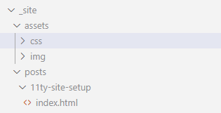
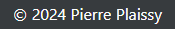
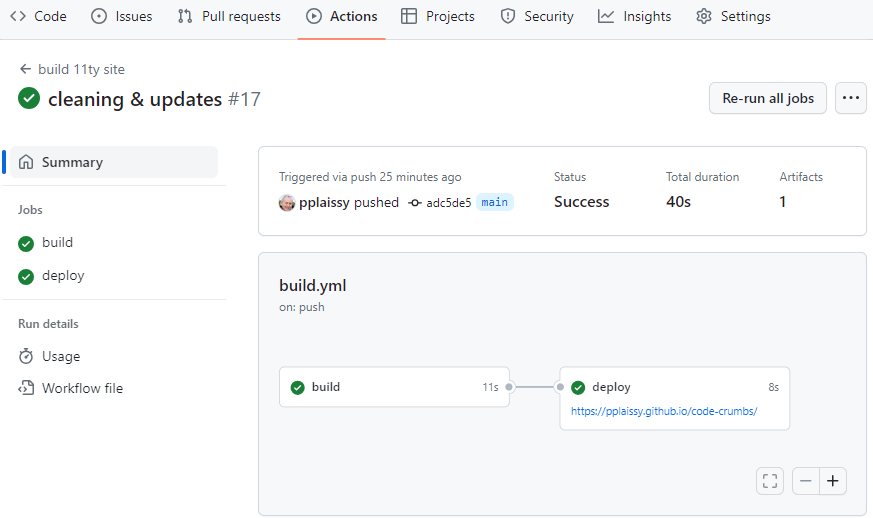

# Setting up this blog site

Quand vous envisagez de déployer un site sur github pages, la doc vous indique que github utilise par défaut Jekyll et à posteriori je me dis que j'aurais probablement dû en rester là. 

Mais après avoir lu tout et son contraire sur les générateurs de sites statiques existants j'ai fini par choisir eleventy. Je dois dire que c'est le commentaire de [Sara Soueidan](https://twitter.com/SaraSoueidan/status/1144696081403523072){.xlk} dont j'avais dévoré les contributions sur [codrops](https://tympanus.net/codrops/author/sarasoueidan/){.xlk} qui a emporté ma décision. Ensuite, quel language template choisir ? plouf plouf, webc semble prometteur, c'est parti !

This blog site is then set up with [eleventy](https://www.11ty.dev){.xlk} and [webc](https://www.11ty.dev/docs/languages/webc/){.xlk}.

Faites-moi savoir si les quelques indications qui suivent vous ont été utiles pour votre propre projet. La repo est [ici](https://github.com/pplaissy/code-crumbs){.xlk}.

## Architecture

Je voulais quelque chose de vraiment élémentaire, un blog site réduit à sa plus simple expression. No About page, no contact form (you can reach me on LinkedIn if necessary), no inanity like 'I like to blog about the stuff I'm interested in'. Just a home page with the posts list linking to each post page.

## Layout

Le header et le footer doivent évidemment se trouver sur chaque page. Pour ça il faut créer un fichier de mise en page et indiquer le nom du fichier dans le front matter. La syntaxe que vous trouverez partout est la suivante considérant que mon fichier de layout se nomme main.webc et se trouve dans le dossier layouts :

`layout: layouts/main.webc`

Mais il est aussi possible de simplifier la déclaration dans le front matter en `layout: main.webc` à condition de déclarer le layouts folder inside the config file :

```json
dir: {
    ...
	layouts: "_includes/layouts"
}
```

### cascading

Il y a un second layout pour le rendu d'un article, post.webc. Il s'agit simplement d'un conteneur qui référence le layout principal et affiche le contenu du post.

```html
---
layout: main.webc
---

<div @html="content"></div>
```


## Relative links

Une des difficultés auxquelles je me suis heurté est la déclaration des liens dans le layout principal (main.webc), dont le href est de la forme 'assets/sub-folder/resource-file'. Par exemple :

`<link rel="stylesheet" href="assets/css/main.css" webc:keep/>`

Lorsqu'on est sur la page principale, pas de problème, le fichier de ressource est bien trouvé. Mais lorsqu'on navigue vers un article dont la page est nestée dans l'arborescence du site, la ressource devient inaccessible.



J'ai fait plein d'essais dans tous les sens dont certains fonctionnaient en local mais pas une fois buildé sur github.

J'ai fini par trouver une solution simple en ce qu'elle tient en une ligne dans l'entête qui ajoute conditionnellement un base ref lorsque l'on se trouve sur la page d'un article :

`<base webc:if="this.page.url.includes('posts')" href="../..">`

## External links target

Pour les liens externes, ceux qui renvoient à des pages extérieures au site, il me semble préférable de les ouvrir par défaut dans un nouvel onglet du navigateur. Pour ça il suffit d'ajouter les attributs {target="_blank" rel="noopener noreferrer"} à la suite du lien mais évidemment on ne veut pas qu'ils apparaissent dans le rendu html.

Une petite recherche m'a rapidement conduit à deux options :

- [markdown-it-for-inline](https://www.npmjs.com/package/markdown-it-for-inline){.xlk} dont l'utilisation est décrite dans cet article de [Frank Noirot](https://v2.franknoirot.co/posts/external-links-markdown-plugin/){.xlk}
- [markdown-it-attrs](https://www.npmjs.com/package/markdown-it-attrs){.xlk} dont il est question sur ce [thread github](https://github.com/11ty/eleventy/issues/2301){.xlk}

J'ai opté pour la seconde qui m'a paru plus simple. Vous noterez que je n'ai pas repris le `.disable("code")` puisque ça fonctionne très bien sans.

`const md = new markdownIt(options).use(markdownItAttrs);`

Bon, il faut bien avouer que ça peut vite devenir pénible de recopier tous ces attributs à la suite de chaque lien externe. Rien que dans ce paragraphe il y est quatre fois. On se demande assez vite s'il ne serait pas possible de faire plus simple. 

Et oui, c'est possible ! En utilisant une classe {.xlk} (par exemple) à la place. Plus léger et plus lisible, non ?

Ça oblige à customiser le markdown renderer pour qu'il ajoute les attributs lorsque la classe est présente, mais ça vaut la peine. Ces quelques lignes dans le .eleventy.js et voila !

```js
// set an instance of markdownIt
const md = new markdownIt(options).use(markdownItAttrs);

// declare a default link renderer
const defaultLinkRender = md.renderer.rules.link_open || function (tokens, idx, options, env, self) {
  return self.renderToken(tokens, idx, options);
};

// set custom render function
md.renderer.rules.link_open = (tokens, idx, options, env, self) => {
  const token = tokens[idx];
  // get the class attribute
  const classAttr = token.attrGet("class");
  // if class attribute exists and contains the external link flag...
  if (classAttr && classAttr.split(' ').includes("xlk")) {
    // ...add the custom attributes
    tokens[idx].attrSet('target', '_blank');
    tokens[idx].attrJoin("rel", "noopener noreferrer");
  }

  // Pass the token to the default renderer.
  return defaultLinkRender(tokens, idx, options, env, self);
};
```

## Dates

En ce qui concerne les dates, I needed two things :

- display the post date on the home page post list items

  

- display the current year beside the copyright icon in the footer

  

Pour ça j'utilise [Luxon](https://moment.github.io/luxon/#/){.xlk} et je déclare deux fonctions dans le fichier de config :

```js
eleventyConfig.addJavaScriptFunction("postDate", (dateObj) => {
	return DateTime.fromJSDate(dateObj).toLocaleString(DateTime.DATE_SHORT);
});

eleventyConfig.addJavaScriptFunction("currentYear", () => {
	return DateTime.now().year;
});
```

Dans le composant footer.webc on a ainsi :

```
<p class="mr" @html="'&copy; ' + currentYear() + ' Pierre Plaissy'"></p>
```

Et dans le composant de liste des articles :

```
<span @html="postDate(post.data.date)"></span>
```

## CI

Le CI m'a donné un peu de mal, les exemples trouvés étant un peu anciens ou adaptés à d'autres configurations. Et la syntaxe yaml m'a donné mal à la tête 🤒. Bref, si mon script peut vous inspirer, j'ai élagué autant que possible et, comme vous pouvez le constater, ça fonctionne parfaitement en l'état.

Pendant la phase de mise au point vous aurez sûrement des erreurs. Pour savoir ce qui se passe, rendez-vous sur l'onglet Actions de la repo.



## Scripting

Enfin, pour écrire mes articles j'utilise [Typora](https://typora.io/){.xlk}. 

Créer un nouvel article consiste simplement à ajouter un fichier .md dans le dossier posts du site et à y insérer la front matter :

```
layout: post.webc
title: this eleventy/webc tiny static blog site
tags: post
description: "To setup this site I used eleventy and webc"
date: 2024-03-06
image: 
    path: ../assets/img/11ty/posts/11ty.png
    alt: 11ty logo
```

Ensuite Je peux mettre cote à cote Typora et mon site en localhost et saisir en voyant le résultat au fur et à mesure 😁.

Sauf qu'il y a encore un soucis...

## Local images paths

Lorsque j'insère une image dans Typora, son path va logiquement être "../assets/etc." et, si le résultat est correct en localhost, sur le site en ligne l'image n'est plus trouvée puisqu'on a ajouté un <base href="../.."> au layout principal. Pour contourner cette difficulté, j'ai modifié le markdown renderer des images dans le fichier de config:

```
md.renderer.rules.image = function (tokens, idx, options, env, self) 
{
    const token = tokens[idx];
    let src = token.attrGet('src');

    // truncate paths for local images 
    token.attrSet('src', src.slice(3));
    token.attrSet('alt', token.content);

    return self.renderToken(tokens, idx, options)
}
```

## Conclusion

Voilà, c'était ma modeste contribution à l'univers eleventy. Vous me direz ce que vous en pensez. 

On a un site statique vraiment simple et facile à maintenir avec peu de fichiers et peu de lignes dans chaque. 

Le seul bémol est cette histoire de résolution des paths au moyen du base ref et du custom image markdown renderer. Ça fait un peu bricolage et quelque chose me dit qu'il y a un truc que je n'ai pas compris. Si quelqu'un pouvait mettre le doigt dessus ce serait formidable.