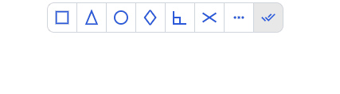

# An options switcher with primeng

On my SVG editor, the user can select one or more snap options on existing drawing elements. And for better UX he must be able to select or deselect all the options at once.

As I am currently experimenting with Primeng to eventually replace Angular Material that I currently use, I wanted to share this small component created from the SelectButton.

To begin with, here is what it looks like in action (150% zoomed for the screenshot purpose).



Voilà ! As you can see, it's a series of toggle buttons plus a switch button on the right, named the **switcher**.

We have two things to implement to achieve the switcher :

- we want it not to have the same appearance as the other buttons, here I gave it a gray background
- we don't want it to toggle when clicked. He changes the states of others but always keeps the same appearance. We want it to behave like a click button.

Let's look into starting with the data model.

## Options

The option button underlying model is a primeng.api.selectitem :

```js
export interface SelectItem<T = any> {
    label?: string;
    value: T;
    styleClass?: string;
    icon?: string;
    title?: string;
    disabled?: boolean;
}
```

The only mandatory property is value. I also use label for tooltips and icon for as the name suggests.

In this POC I can simply initialize the options array in the model ctor, but it is obviously possible to put all of this in a dedicated service :

```
this.options.push({label: "Extrémité", value: SvgEntityPointStyleEnum.end, icon: "grip_end"});
... and so on
... and finally the switcher
this.options.push({label: "Tout", value: SvgEntityPointStyleEnum.none, icon: "select_all"});
```

I use an enum as id/value for each option. The switcher id is 0.

```js
export enum SvgEntityPointStyleEnum {
    none = 0,
    end,
    middle,
    center,
	...
}
```

In my model, I therefore have two variables:

```js
options: SelectItem[] = [];
selectedOptions: number[] = [];
```

## Display

To customize the appearance of the switcher I add a conditional class 'switch-button' when the value of the option is SvgEntityPointStyleEnum.none (=== 0) in the component template.

```html
<p-selectButton 
    [options]="model.options" 
    [multiple]="true" 
    [(ngModel)]="model.selectedOptions" 
    (onOptionClick)="model.onGripOptionClick($event)">
    <ng-template let-item pTemplate>
        
    </ng-template>
</p-selectButton>

```

Selected view items are 2ways bound to the model's selectedOptions variable via [(ngModel)]. When I click a button, the selectedOptions array values are automatically updated. And update the array by code triggers the view update in return.

the switch button background color is styled by css :

```css
:host ::ng-deep .p-selectbutton .p-button:has(> .switch-button) {
    background-color: rgb(233, 232, 232);
}
```

## Behavior

All that remains is to prevent the switch button from displaying a toggle state. We can do this by modifying its style when it takes the "selected" state (primeng set the p-highlight class) in css, but I preferred to do it in js via the `(onOptionClick)="model .onGripOptionClick($event)"`. This allows you to never have it id in the selectedItems array.

I use the `onGripOptionClick` method to intercept the switch button click event.

```
onGripOptionClick(e: SelectButtonOptionClickEvent): void {
    if (e.option.value === SvgEntityPointStyleEnum.none) {
        // user has clicked on the switch button
        // the switch id juste became added to the model selectedOptions number array
        // so if selectedOptions contains a single value it is necessarily 0
        // that means there is no grip currently selected
        if (this.selectedOptions.length === 1) {
        	// there is no grip currently selected, we select all of them
            this.selectedOptions = [...this.options.filter(x=> x.value !== SvgEntityPointStyleEnum.none).map(x=> x.value)];
        } else {
        	// in all other cases we deselect all
            this.selectedOptions.splice(0);
        }
    }
}
```

that's it that's all !

Too light to consider a npm repo. If you want something like that, rather make your own classes perfectly adapted to your needs.

## Always further

From there we can imagine some design improvements, for example by changing the switcher icon depending on the state of the options to indicate to the user what will happen if he clicks on it, in this case selection or deselection of all the options.