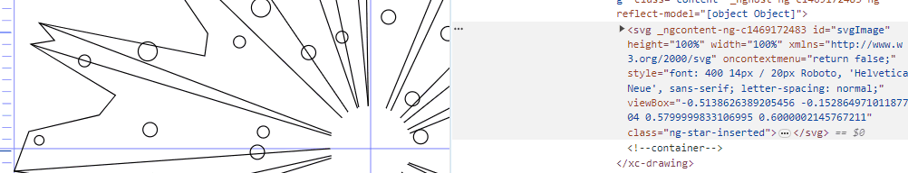

# A SVG vector-effect issue

The other day I was working no a new version of my SVG graphics editor when I came across this confusing   [vector-effect](https://developer.mozilla.org/en-US/docs/Web/SVG/Attribute/vector-effect#non-scaling-stroke){.xlk} behavior.

As indicated in the documentation, the non-scaling-stroke value "has the resulting visual effect [...] that the stroke width is not dependent on the transformations of the element (including non-uniform scaling and shear transformations) and zoom level".

This is perfect if you want to be able to zoom in on an image while maintaining a constant stroke width, which was my case.

## zoom

There are two ways of zooming in on an SVG :

- Either by adding a matrix transform
- Or by modifying the viewBox

I chose the second option and created this little function that modifies the viewBox to change the zoom factor, centred on the position of the pointer. For those interested, it looks like this :

```js
zoom(e: any): void {
    const cvb = this.svgElement.viewBox.baseVal;
    const mouseSvgPoint = this.getSvgPointFromClientPoint(this.svgElement, e.clientX, e.clientY);
    const zoomFactor = e.deltaY < 0 ? 1 / 1.2 : 1.2

    // Update current zoom factor
    this.currentZoomFactor /= zoomFactor;

    // viewBox size after zoom
    const targetWidth = cvb.width * zoomFactor;
    const targetHeight = cvb.height * zoomFactor;
    // zoom delta
    const deltaX = cvb.width - targetWidth;
    const deltaY = cvb.height - targetHeight;

    // Pointer distance to origin
    const mouseDistX = Math.sqrt(Math.pow(mouseSvgPoint.x - cvb.x, 2));
    const mouseDistY = Math.sqrt(Math.pow(mouseSvgPoint.y - cvb.y, 2));
    // Pointer distance to origin width ratio
    const mouseDistXRatio = mouseDistX / cvb.width;
    const mouseDistYRatio = mouseDistY / cvb.height;
    // Apply changes
    const vbx = cvb.x + deltaX * mouseDistXRatio;
    const vby = cvb.y + deltaY * mouseDistYRatio;
}
```

It works well. In the screenshot below, you can see how the viewBox attribute is updated by the zoom function triggered by the mouse wheel. 



## Scaling stroke

Contrary to what can be seen in the previous screenshot, by default the rendering of line thicknesses is not constant when the viewBox changes, this is the normal behaviour.


## Non scaling stroke

As I said at the beginning, you can avoid this visual scaling by using the vector-effect attribute. Below I’ve applied it to circles and lines but not to the path.

```html
<circle
    ...
    stroke-width="1"
    vector-effect="non-scaling-stroke">
</circle>

```


## Loosing pointer events

Now I’m adding a css :hover to the graphic items to display the event capture.

```css
.graphic-item:hover {
    stroke-width: 4 !important;
}
```


And that’s where things go wrong. Everything’s fine up to a certain zoom factor (which I haven’t managed to determine) where the circles lose the events. And the same is true for ellipses and path arcs. If I have a path with straight segments and a curved segment, the straight segment remains hooverable whereas the curved segment no longer reacts.

## Conclusion

I haven’t found any reference to this on the net. If anyone has any clues, I’d love to hear from you.

I’m currently using a binding method that gives a better visual result overall. With non-scaling-stroke, the line thickness is constant, so when you zoom out a lot and the drawing is “far away” it becomes unreadable because the line thickness completely crushes it. With stroke binding, the thickness of the lines can be calculated in proportion to the zoom factor, giving a very nice rendering at all scales.

